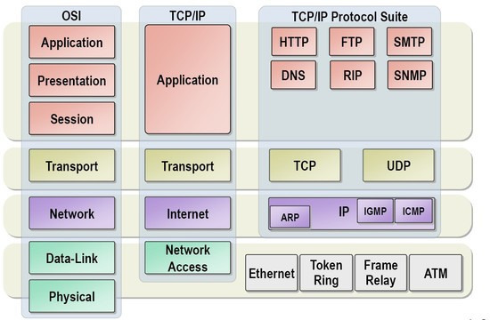

이번 글에서는 저번 [TCP/IP의 개념 올바르게 이해하기
](https://velog.io/@ksk0605/TCPIP%EC%9D%98-%EA%B0%9C%EB%85%90-%EC%98%AC%EB%B0%94%EB%A5%B4%EA%B2%8C-%EC%9D%B4%ED%95%B4%ED%95%98%EA%B8%B0)에 이어서 TCP와 UDP 헤더의 차이점을 분석해보도록 하겠습니다. 그 전에 먼저 저번 시간의 간단한 복습과 알아야할 정보들을 살펴보도록 하죠.  

# TCP와 UDP
__TCP__ 와 __UPD__ 는 __OSI 7Layer__ 와 __TCP/IP 4Layer__ 의 __Transport Layer__ 에 속하는 프로토콜로 이름에 걸맞게 컴퓨터끼리의 올바른 전송을 위해 송신자와 수신자를 연결하는 역할을 하는 친구들입니다.   

TCP는 연결 지향 전송 방식의 프로토콜로 내가 송신하고자 하는 상대방에게 송신여부를 확실히하고 보낸 데이터의 순서도 정확하게 보내고 싶을 때 사용합니다. 
반면에 UDP는 비연결 지향 전송 방식의 프로토콜로 그저 보내는 것에 집중하기 때문에 데이터의 정확성은 부족하지만 빠르다는 장점이 있죠.   
보시는 바와 같이 TCP와 UDP는 하는 일은 비슷하지만 __서로 지향하는 바가 다른 프로토콜__ 입니다. 
한 가지 더 알아야 하는 정보가 있다면 TCP와 UDP모두 패킷 전송을 위한 프로토콜이라는 것입니다. 패킷은 데이터를 효율적으로 전송하기 위해 통데이터를 작은 단위로 쪼개서 보내자는 아이디어에서 나온 개념입니다. 각각의 네트워크 레이어에서는 그저 데이터에 불과한 잘게 쪼개진 패킷에 각각 자신의 목적에 맞는 헤더를 붙여가며 패킷을 완성시켜가죠.  TCP와 UDP가 서로 다르다는 것은 결국 같은 레이어임에도 불구하고 이 헤더가 다르기 때문에 다르게 작동할 수 밖에 없다고 이해하시면 좋습니다. 지향하는 바가 다른 만큼 
당연히 헤더의 구조도 다를 수 밖에 없겠죠. 
   
지금부터 각각의 헤더구조를 직접 살펴보면서 구조의 차이를 분석해보도록 하겠습니다. 
   
# TCP헤더

TCP헤더는 위와 같은 구조로 되어있습니다. 하나씩 살펴보겠습니다.
## Source Port & Destination Port
보내는 포트 번호(source port)와 받는 쪽의 포트 번호(destination port)입니다. 데이터를 보내는 것이 목적인 헤더인데 당연히 가장 중요한 정보 중 하나겠죠? 
## Sequence Number 
두 번째 줄은 byte단위로 순서화 되는 번호입니다. TCP는 패킷에 번호를 붙여서 신뢰성을 보장한다고 저번 글에 말씀드렸죠? 이 번호가 바로 그 역할을 하게 됩니다. 이 정보를 통해 TCP 프로토콜은 데이터 중복을 확인하거나 데이터를 보내는 양 등등을 조절할 수 있게 됩니다.  
 
이때 가장 먼저 보내는 패킷에는 ISN (Initial Sequence Number)라는 값을 할당하게 됩니다. 이 숫자를 기점으로 패킷의 순서를 결정하는 것 이죠. 일반적으로 Sequence Number의 값은 4ms마다 변화된다고 합니다. 따라서 ISN값은 4.55시간에 한 번씩 동일해지는 꼴이 되죠. 하지만 네트워크에서 패킷이 살아있는 시간(Maximum Segment Lifetime)은 항상 4.55시간 보다 작기 때문에. 그래서 ISN값은 항상 유니크하게 생성됨이 보장되고 패킷 번호들이 혹여나 겹칠 걱정은 안해도 괜찮게 됩니다.

## Acknowlegment Number
 TCP는 3-way-handshaking 방식을 사용하는데 이때 연결요청으로 SYN을 보내고 ACK를 통해 요청을 잘 받았다는 것을 알 수 있다고 했죠? 여기서 말하는 ACK가 바로 이것입니다. 
## Data Offset
TCP헤더의 크기는 유동적입니다. 위 사진에서 20bytes라고 적혀있는 부분까지는 고정이지만 아래 option 때문에 크기가 달라지게 되죠. 따라서 실제 데이터가 어디부터 시작인지 알려줘야 하기 때문에 해당 값을 사용합니다. 
## Reserved
혹시 모를 미래를 위해 만들어놓은 정보이며 항상 0으로 세팅되어야 합니다. 원래는 6bit으로 만드려고 했다가 3bit으로 줄였다고 하는군요.
## Flag 
각 패킷(더 정확하게 세그먼트)의 용도를 결정하는 비트입니다. URG, ACK, PSH, RST, SYN, FIN의 6개가 존재했는데 역사 가운데 명시적인 혼잡제어가 필요해지면서  NS, CWR, ECE 세 가지가 추가되었고 여기서 Reserved가 사용됩니다. 
* URG : 아래 설명할 URG에 먼저 봐야할 것이 있을 때 사용
* PSH : 수신자에게 버퍼링된 데이터를 푸시할지 여부
* RST : 커넥션을 리셋하겠다는 의미로, 이것이 1로 set되어 있는 세그먼트를 받으면 즉시 연결해제
* ACK : Acknowledge Number가 있는지 여부
* SYN : Sequence Number가 있는지 여부
* FIN : 더이상 보낼 데이터가 없다는 것을 의미. 연결 종료 과정인 4-way Handshaking 때 사용.
* NS : ECN에서 사용하는 CWR, ECE 필드가 실수나 악의적으로 은폐되는 경우를 방어하기 위한 필드
* CWR : Congestion Window Reduced의 약자로, 혼잡 제어 메커니즘에 의해 응답했음을 알리는 의미.
* ECE는 ECN Echo 플래그로 윈도우 크기를 줄일지 여부를 알림. 
## Window Size
수신하고자 하는 윈도우 크기를 알리는 필드입니다. 송신자는 이 윈도우 사이즈에 맞춰서 패킷 수를 조절해야 합니다.
## Checksum
패킷의 오류를 검증하기 위한 필드입니다. 헤더 및 데이터를 16bit 단위로 분할하여 비트 합을 구한 뒤 여기에 1의 보수를 취한 값으로 무엇가 변경된 것이 있다면 다른 값이 나오게 되어 검증이 가능합니다. 
## Urgent Pointer
URG Flag가 설정되어있을 때만 사용하는 필드로 긴급하게 보아야할 정보가 있을 때 사용합니다. 
## Options
앞서 말한 TCP의 유동적인 데이터 크기의 이유로 TCP 기능을 확장할 때 사용합니다. 

# UDP 헤더

TCP에 비해 훨씬 간단하죠? 신뢰성을 보장하는 연결지향성인 TCP는 그만큼 다양한 필드를 통해 패킷들이 관리가 되어야 하지만 그저 보내는 것이 목적인 UDP는 훨씬 간단한 구조를 가지고 있습니다. UDP헤더가 붙은 패킷은 각각 독립적인 객체라는 뜻으로 특별히 데이터그램이라고 부릅니다.  
 
독립적이라는 단어를 더 자세히 풀면 동일한 발신지 프로그램으로부터 동일한 목적지 프로그램으로 전송되더라도 서로 다른 데이터그램들 사이에는 아무런 연관 관계가 없다는 뜻입니다. 따라서 데이터그램에는 TCP와 달리 각각의 번호가 붙지 않으며 연결 설정, 종료 과정이 없습니다.
## Source Port & Destination Port 
UDP도 마찬가지로 보낸 포트 받는 포트가 필요하겠죠? 
## Length
UDP헤더와 데이터를 모두 포함한 값으로 데이터그램의 헤더인 8바이트부터 65507바이트 사이의 값이 됩니다.
## Checksum
TCP와 마찬가지로 데이터 검증을 위한 필드입니다. 

# 마무리
이번 글에선 함께 TCP와 UDP의 헤더를 분석해보았습니다. TCP는 신뢰성과 정확성을 중요시하는 애플리케이션에, UDP는 속도와 실시간성을 중요시하는 애플리케이션에 적합하다고 많이 이야기 하지만 그 이유가 왜 인지 더욱 정확하게 알려면 한번은 이렇게 제대로 공부할 필요가 있지 않을까 생각이 드네요.  
더 좋은 글로 돌아오도록 하겠습니다 감사합니다!

# Reference
* https://engineer-mole.tistory.com/140
* https://evan-moon.github.io/2019/11/10/header-of-tcp/ -> 매우 좋은글!
* https://nirsa.tistory.com/29
* https://velog.io/@inourbubble2/TCP-Header%EB%A5%BC-%EC%95%8C%EB%A9%B4-TCP%EB%A5%BC-%EC%9D%B4%ED%95%B4%ED%95%A0-%EC%88%98-%EC%9E%88%EB%8B%A4 -> 이것도 좋은글!