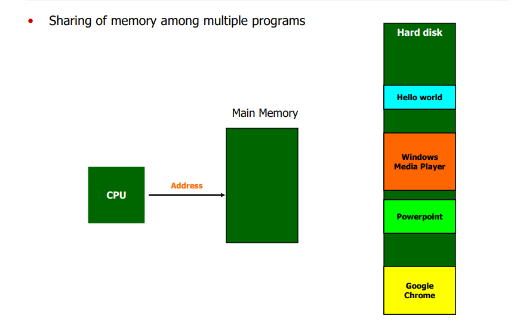

### Virtual Memory란?
virtual은 눈에 보이지 않지만 존재하는 것
Windows와 Linux같은 운영체제에서 제공함 virtual page를 physical page로 mapping시켜주는 역
사용하게 되면 결과적으로 Main memory를 Secondary storage에 대한 cash인 것 처럼 사용하게 됨

#### Virual memory는 physical memory로부터 프로그래머 관점의 논리 메모리를 분리해 메인 메모리를 균일한 크기의 저장 공간으로 구성된 매우 큰 배열로 추상화시켜줌
#### ->크기 제약으로부터 자유로워짐
#### Virtual memory는 파일과 라이브러리의 공유를 쉽게 만들어주고 공유 메모리 구현을 가능하게 함

사용하게 되는 동기
1. Sharing of memory among multiple programs
2. Hard disk에 들어있는 program들 -> Main memory에 로딩
3. 언제, 어떤 프로그램과 함께 하나의 main memory를 가지고 실행할 지 모른다 -> 주소 관점에서 달라질 수 있는데
4. 컴파일 하는 입장에서는 모르기 때문에
5. 가상의 virtual memory space가 있다고 보고, virtual address를 기준으로 각 instruction의 address를 생성하는 것이 훨씬 쉽다
6. 운영체제의 virtual memory technique을 통해 physical address를 생성하도록 하면된다

두번째 관점
main memory capacity가 넘는 경우 : 프로그램의 꼭 사용되는 부분만 main memory에서 쓰고 가상으로 생각한 공간을 조각조각 
운영체제가 내서 꼭 필요한 조각만 main memory에서 쓰고 가상공간에서 내가 원하는 프로그램을 짜면 되는 거다

### 가상메모리 구현 :
가상 메모리는 프로세스가 실행되는 동안 프로세스가 사용하는 모든 메모리 영역을 물리적인 메모리보다 큰 가상 메모리 공간으로 할당한다.
이때 프로세스가 사용하는 메모리 중 일부는 물리적 메모리에 저장되고, 일부는 디스크의 스왑 파일(Swap file)이나 페이지 파일(Page file)에 저장된다. 
이를 페이징(Paging) 또는 스왑핑(Swapping)이라고 한다.
페이징은 가상 메모리의 일부를 고정 크기의 페이지(Page)로 나누고, 물리적 메모리에 필요한 페이지만 적재하는 기술이다. 이 방식은 물리적 메모리의 일부만 사용하고, 나머지 부분은 디스크에 저장하므로 물리적 메모리의 부족 문제를 해결할 수 있다.

스왑핑은 물리적 메모리에 있는 페이지 중 일부를 스왑 파일로 옮겨 놓고, 해당 페이지를 다시 필요로 할 때 스왑 파일에서 불러와서 사용하는 기술이다. 이 방식은 물리적 메모리에 충분한 공간이 없을 때 사용된다.

결국, 가상 메모리와 스왑핑은 물리적인 메모리의 한계를 극복하기 위한 기술로써, 가상 메모리를 이용하면 더 많은 프로그램을 동시에 실행할 수 있고, 스왑핑을 이용하면 물리적인 메모리의 부족 문제를 해결할 수 있다. 하지만 스왑핑은 디스크에 접근하는 속도가 느리기 때문에, 빈번한 스왑핑은 시스템 성능 저하를 유발할 수 있다.
따라서, 가상 메모리와 스왑핑을 효율적으로 사용하기 위해서는 메모리의 용량과 사용 패턴을 고려하여 적절한 조절이 필요하다.

### Reference
(https://blog.naver.com/ds4ouj/222673263919)
(https://blog.naver.com/rlxk751/223007920940)
(https://blog.naver.com/vita1202/223014664912)
